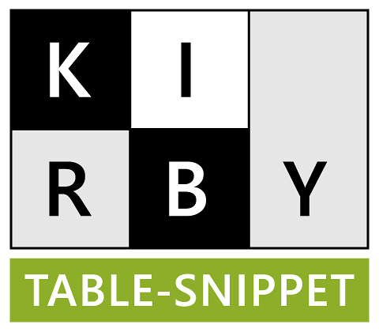
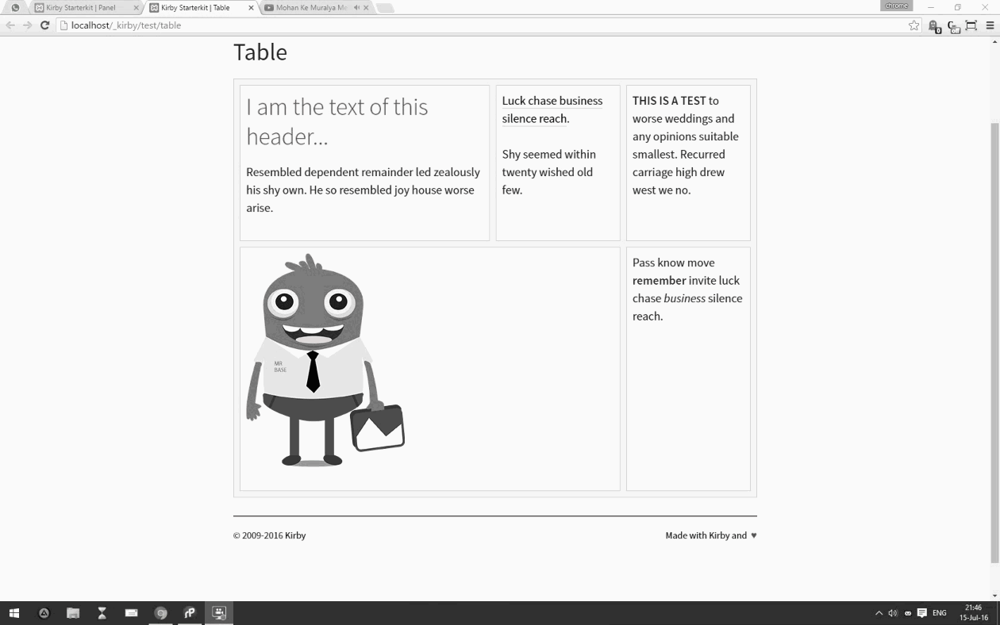

# [Kirby - Table](https://github.com/1n3JgKl9pQ6cUMrW/kirby-table)

****

#### Version 1.0.0 - 2016-07-16

- Initial Public Offering.

****

### What is it?

**[Kirby - Table](https://github.com/1n3JgKl9pQ6cUMrW/kirby-table)** is a snippetfield for creating tables (cells) in Kirby.

It uses the **excellent** Kirby Snippetfield from **https://github.com/jenstornell/kirby-snippetfield** as it's core-engine - **and can't do without**.

More info about Kirby can be found at **http://getkirby.com**

### Installation

- Download the .zip from GitHub and extract it to the root of your site.
- Be sure to download the Kirby Snippetfield as well; https://github.com/jenstornell/kirby-snippetfield

Like all fields, the Snippetfield must be placed in `/site/fields/` (a placeholder is allready created).

### Usage

This Table Snippet is not an "out of the box solution" for everyone; it just shows the power of the Snippetfield in combination with Kirby.

Once you have unzipped both the table-assets and the snippetfield-assets, you can navigate to `http://yourwebsite.com/table`

A (very) rudimentary table is displayed on that, basic, page.

This table can be filled from the panel (just navigate to the `table` page) and is powered by both the `/blueprints/table.yml` and the `/snippets/panel/table.php` snippet.

The page itself is rendered by `/templates/table.php` - examine all those field, change them were you want and get of and running.

**Remember**; you have to define the **maximum used cells* in your table at least once (in the first visibile cell). The best thing is to draw the table first (pen and paper...), and count the maximum used cells on a row (_this is the number that must be entered at least in the first cell_).

This number is (also) used to preview the (relative) width of every cell and create the according `colspan` tag.

Rows are automatically created, when a row is "full" and both `thead` and `tfooter` are not supported (to keep things simple).

Each cell can have it's own `#ID` and `.classname` (which can be usefull for responsive behaviour) - the example does not use this, 'though.

### Features

1. Create cells on the fly.
2. Unlimited rows, one table per field (you can create extra fields).
3. Set / change / modify the colspan for every cell.
4. A cell can contain, but is not limited to, textarea's / images / lists / etc...
5. Re-arrange the order of all rows / cells (as long as the rows are completely filled).

****

*Kirby Table - create your table on the fly.*